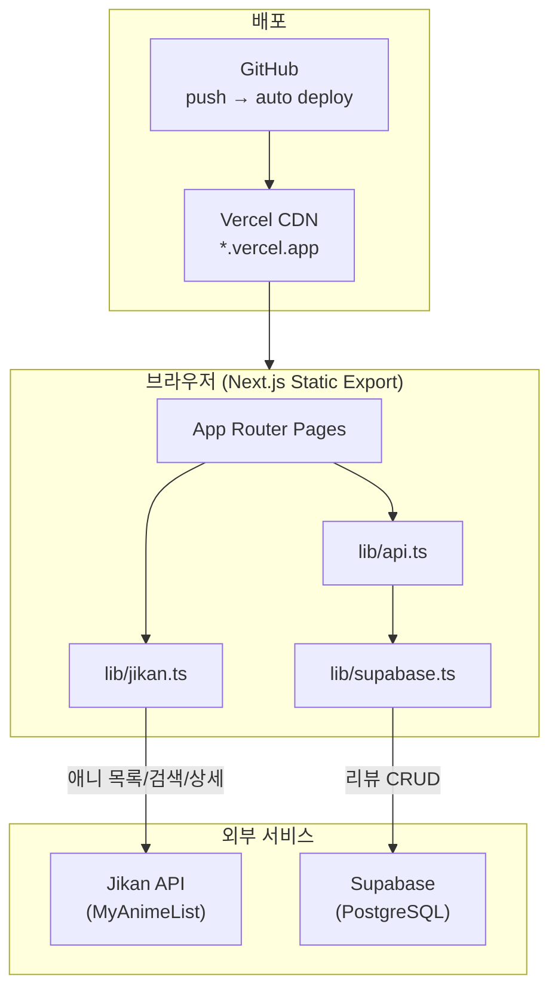
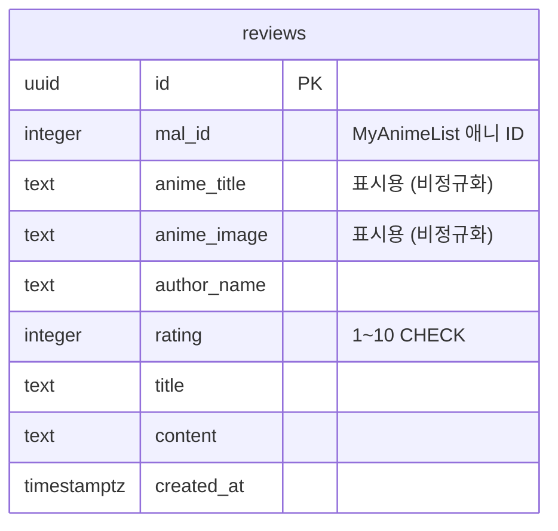

# 애니리뷰 (Ani Review)

> MyAnimeList 기반 애니메이션 탐색 + 커뮤니티 리뷰 플랫폼

애니메이션 메타데이터는 **Jikan API**에서 실시간으로 가져오고, 사용자 리뷰는 **Supabase**에 저장하는 정적 웹 애플리케이션입니다.  
Next.js Static Export + Vercel 배포로 운영 비용 없이 빠르게 서비스할 수 있는 구조를 목표로 설계했습니다.

| | |
|---|---|
| **라이브** | [private-ani-review.vercel.app](https://private-ani-review.vercel.app/) |
| **배포** | Vercel |
| **저장소** | [github.com/dmnkx/ani-review](https://github.com/dmnkx/ani-review) |
| **역할** | 기획 · 설계 · 풀스택 개발 · 배포 |
| **기간** | 2026.07 |

---

## 목차

- [프로젝트 개요](#프로젝트-개요)
- [주요 기능](#주요-기능)
- [기술 스택](#기술-스택)
- [시스템 아키텍처](#시스템-아키텍처)
- [핵심 설계 결정](#핵심-설계-결정)
- [데이터베이스 설계](#데이터베이스-설계)
- [프로젝트 구조](#프로젝트-구조)
- [페이지 구성](#페이지-구성)
- [로컬 실행 방법](#로컬-실행-방법)
- [배포 (Vercel)](#배포-vercel)
- [개발 과정에서의 고민](#개발-과정에서의-고민)
- [향후 개선 계획](#향후-개선-계획)

---

## 프로젝트 개요

### 배경

애니메이션 리뷰 사이트를 만들고 싶었지만, 수만 편의 애니 메타데이터를 직접 DB에 관리하는 것은 비현실적이었습니다.  
대신 **외부 API로 애니 정보를 읽고, 우리 서비스에 필요한 데이터(리뷰)만 DB에 저장**하는 하이브리드 구조를 선택했습니다.

### 한 줄 요약

> Jikan(MyAnimeList)에서 애니를 탐색하고, Supabase에 리뷰를 남기는 **정적 애니 리뷰 커뮤니티**

### 이 프로젝트에서 다룬 것

- Next.js App Router 기반 SPA형 정적 사이트 구축
- 외부 REST API(Jikan) 연동 및 클라이언트 사이드 데이터 페칭
- Supabase(PostgreSQL + RLS)를 활용한 리뷰 CRUD
- Static Export + Vercel 자동 배포 파이프라인 구성
- 한국어 UX(공식 한국어 제목 오버라이드) 적용

---

## 주요 기능

### 애니 탐색 (Jikan API)

- MyAnimeList **인기 순위** 목록 조회 (페이지네이션 "더 보기")
- 애니 **제목 검색** (디바운스 500ms)
- 애니 **상세 페이지**: 포스터, 줄거리, 장르, 방영 연도, 제작사, MAL 평점

### 리뷰 커뮤니티 (Supabase)

- 애니 검색 후 **리뷰 작성** (닉네임, 1~10점 별점, 제목, 본문)
- 애니 상세에서 **커뮤니티 평균 평점** 표시 (MAL 평점과 별도)
- **전체 리뷰** 목록 및 홈 **최신 리뷰** 피드

### UX / UI

- 다크 테마 기반 반응형 UI (Tailwind CSS 4)
- 로딩·빈 상태·Supabase 미설정 안내 컴포넌트
- 주요 작품 **공식 한국어 제목** 표시 (라프텔/넷플릭스 기준)

---

## 기술 스택

| 구분 | 기술 | 선택 이유 |
|------|------|-----------|
| **프레임워크** | Next.js 15 (App Router) | 파일 기반 라우팅, React 19, Vercel 최적 호환 |
| **언어** | TypeScript | API 응답·DB 스키마 타입 안정성 |
| **스타일** | Tailwind CSS 4 | 빠른 UI 프로토타이핑, 다크 테마 커스터마이징 |
| **애니 데이터** | [Jikan API](https://jikan.moe) v4 | API 키 불필요, MyAnimeList 메타데이터 무료 제공 |
| **데이터베이스** | Supabase (PostgreSQL) | 관리형 Postgres, RLS, 빠른 프로토타이핑 |
| **배포** | Vercel | Git push 기반 자동 배포, Static Export 지원 |
| **버전 관리** | GitHub | `main` 브랜치 push → Production 자동 배포 |

---

## 시스템 아키텍처



### 데이터 흐름

| 데이터 | 출처 | 저장 여부 |
|--------|------|:--------:|
| 애니 제목, 포스터, 줄거리, 장르, MAL 평점 | Jikan API | X (실시간 조회) |
| 사용자 리뷰 (평점, 본문, 닉네임) | Supabase | O |
| 애니 식별자 | MyAnimeList `mal_id` | O (리뷰에 포함) |

애니 메타데이터를 DB에 중복 저장하지 않아 **DB 용량·동기화 부담을 최소화**했습니다.  
리뷰 목록 표시 속도를 위해 `anime_title`, `anime_image`는 리뷰 레코드에 **비정규화**하여 함께 저장합니다.

---

## 핵심 설계 결정

### 1. Static Export (`output: "export"`)

서버 없이 Vercel CDN에서 정적 파일만 서빙합니다.  
애니 데이터·리뷰 모두 **클라이언트에서 fetch**하므로 별도 백엔드 서버가 필요 없습니다.

```ts
// next.config.ts
const nextConfig = {
  output: "export",
  images: { unoptimized: true },
};
```

### 2. 애니는 `mal_id`로 식별

초기에는 Supabase에 `anime` + `reviews` 테이블을 두었으나, Jikan 연동 후 **애니 테이블을 제거**하고 `mal_id`(MyAnimeList ID)로 통일했습니다.  
외부 API와 DB 간 ID 체계를 맞춰 데이터 일관성을 확보했습니다.

### 3. 한국어 제목 오버라이드

Jikan은 한국어 제목을 제공하지 않습니다.  
주요 작품에 대해 `KO_TITLE_OVERRIDES` 맵으로 공식 한국어 제목(라프텔/넷플릭스 기준)을 적용했습니다.

### 4. RLS(Row Level Security)

현재는 익명 리뷰를 허용하는 MVP 단계로, `SELECT`/`INSERT` 정책을 공개 설정했습니다.  
추후 Supabase Auth 연동 시 정책을 `authenticated` 사용자 기준으로 변경할 수 있도록 설계했습니다.

---

## 데이터베이스 설계

### ERD



> `anime` 테이블 없음 — 애니 메타데이터는 Jikan API가 단일 소스(Single Source of Truth)

### `reviews` 테이블

| 컬럼 | 타입 | 설명 |
|------|------|------|
| `id` | `uuid` | PK, `uuid_generate_v4()` |
| `mal_id` | `integer` | MyAnimeList 애니 ID (NOT NULL) |
| `anime_title` | `text` | 애니 제목 (리뷰 목록 표시용) |
| `anime_image` | `text` | 포스터 URL (리뷰 카드 표시용) |
| `author_name` | `text` | 작성자 닉네임 |
| `rating` | `integer` | 평점 1~10 (`CHECK` 제약) |
| `title` | `text` | 리뷰 제목 |
| `content` | `text` | 리뷰 본문 |
| `created_at` | `timestamptz` | 작성 시각 (기본값 `now()`) |

### 인덱스

- `reviews_mal_id_idx` — 애니 상세 페이지 리뷰 조회
- `reviews_created_at_idx` — 최신 리뷰 정렬

스키마 정의: [`supabase/schema.sql`](./supabase/schema.sql)

---

## 프로젝트 구조

```
ani-review/
├── src/
│   ├── app/                    # Next.js App Router 페이지
│   │   ├── page.tsx            # 홈 (인기 애니 + 최신 리뷰)
│   │   ├── anime/
│   │   │   ├── page.tsx        # 애니 목록 (검색 + 더 보기)
│   │   │   └── view/page.tsx   # 애니 상세 + 리뷰 목록
│   │   ├── reviews/page.tsx    # 전체 리뷰
│   │   ├── write/page.tsx      # 리뷰 작성 (애니 검색)
│   │   ├── layout.tsx          # 공통 레이아웃
│   │   └── globals.css         # Tailwind + 커스텀 테마
│   ├── components/             # 재사용 UI 컴포넌트
│   │   ├── AnimeCard.tsx       # 애니 카드 (포스터, MAL 평점)
│   │   ├── ReviewCard.tsx      # 리뷰 카드
│   │   ├── StarRating.tsx      # 1~10점 별점 입력/표시
│   │   ├── Header.tsx / Footer.tsx
│   │   ├── LoadingSpinner.tsx / EmptyState.tsx
│   │   └── SupabaseSetupBanner.tsx
│   ├── lib/
│   │   ├── jikan.ts            # Jikan API 클라이언트
│   │   ├── supabase.ts         # Supabase 클라이언트 초기화
│   │   ├── api.ts              # 리뷰 CRUD 함수
│   │   └── utils.ts            # 날짜 포맷, 평점 색상 등
│   └── types/index.ts          # Anime, Review 타입 정의
├── supabase/
│   └── schema.sql              # DB 스키마 + RLS + 샘플 데이터
├── next.config.ts              # Static Export 설정
├── vercel.json                 # URL rewrite, 보안 헤더
└── .env.local.example          # 환경 변수 템플릿
```

---

## 페이지 구성

| 경로 | 설명 | 데이터 소스 |
|------|------|-------------|
| `/` | 히어로 + 인기 애니 8개 + 최신 리뷰 4개 | Jikan + Supabase |
| `/anime` | 인기 애니 목록, 검색, 더 보기 | Jikan |
| `/anime/view?id={mal_id}` | 애니 상세, MAL 평점, 커뮤니티 리뷰 | Jikan + Supabase |
| `/reviews` | 전체 리뷰 목록 | Supabase |
| `/write` | 애니 검색 → 리뷰 작성 | Jikan + Supabase |

`vercel.json` rewrite로 `/anime/{id}` → `/anime/view?id={id}` 경로도 지원합니다.

---

## 로컬 실행 방법

### 1. 의존성 설치

```bash
npm install
```

### 2. Supabase 설정

1. [Supabase](https://supabase.com)에서 프로젝트 생성
2. SQL Editor에서 [`supabase/schema.sql`](./supabase/schema.sql) 실행
3. **Project Settings → API**에서 URL과 **Publishable key** 복사

| 키 종류 | 형식 | 용도 |
|---------|------|------|
| Publishable key | `sb_publishable_...` | 프론트엔드 (이 프로젝트에서 사용) |
| Secret key | `sb_secret_...` | 서버 전용 (사용하지 않음) |

### 3. 환경 변수

```bash
cp .env.local.example .env.local
```

```env
NEXT_PUBLIC_SUPABASE_URL=https://xxxxx.supabase.co
NEXT_PUBLIC_SUPABASE_ANON_KEY=sb_publishable_xxxxxxxx
```

> 변수명은 `ANON_KEY`이지만 값에는 **Publishable key**를 넣습니다.

### 4. 개발 서버 실행

```bash
npm run dev
```

[http://localhost:3000](http://localhost:3000) 에서 확인

---

## 배포 (Vercel)

### GitHub 연동 자동 배포 (권장)

```text
코드 수정 → git push (main) → Vercel 자동 빌드/배포 → *.vercel.app 반영
```

1. GitHub 저장소에 push
2. [Vercel Dashboard](https://vercel.com/new)에서 저장소 Import
3. **Environment Variables** 등록 (필수):

| Name | Value |
|------|-------|
| `NEXT_PUBLIC_SUPABASE_URL` | Supabase Project URL |
| `NEXT_PUBLIC_SUPABASE_ANON_KEY` | Publishable key |

4. Deploy → 이후 `main` push마다 자동 재배포

> `NEXT_PUBLIC_*` 변수는 **빌드 시점**에 코드에 포함됩니다.  
> 환경 변수 추가/변경 후에는 **Redeploy**가 필요합니다.

### 빌드 설정 (자동 감지)

| 항목 | 값 |
|------|-----|
| Framework | Next.js |
| Build Command | `npm run build` |
| Output Directory | `out` |

---

## 개발 과정에서의 고민

### Q. 애니 데이터를 DB에 저장할까, API로 가져올까?

**결론: Jikan API 실시간 조회**

- MyAnimeList에는 수만 편의 애니가 있어 직접 DB 관리는 비현실적
- Jikan은 API 키 없이 무료로 메타데이터 제공
- 리뷰만 Supabase에 저장해 **관리 범위를 최소화**

### Q. Static Export에서 동적 라우트는?

**결론: 쿼리 파라미터 방식 (`/anime/view?id=`)**

`output: "export"`에서는 빌드 시점에 모든 `[id]` 경로를 알아야 합니다.  
Supabase/Jikan 기반 동적 ID는 빌드 시 알 수 없으므로, 쿼리 파라미터 + `vercel.json` rewrite로 해결했습니다.

### Q. Jikan 레이트 리밋 대응

Jikan 공용 API는 **분당 약 60회** 제한이 있습니다.

- 검색에 500ms 디바운스 적용
- 요청 취소(`requestId` ref)로 중복 요청 방지
- API 실패 시 빈 목록 + 콘솔 로그 (사용자에게 graceful degradation)

### Q. Supabase 키 체계 변경

Supabase가 `anon` key → **Publishable key** (`sb_publishable_...`)로 전환했습니다.  
프론트엔드 전용 키이므로 브라우저에 노출해도 RLS로 보호됩니다.

---

## 향후 개선 계획

- [ ] Supabase Auth 연동 (로그인 사용자만 리뷰 작성)
- [ ] 리뷰 수정/삭제 기능
- [ ] 한국어 제목 자동화 (AniList 등 추가 API 연동)
- [ ] 장르/시즌별 애니 필터
- [ ] Open Graph 메타태그 (SNS 공유 미리보기)
- [ ] Jikan 응답 캐싱 (localStorage / SWR)

---

## Jikan API 참고

| 용도 | 엔드포인트 |
|------|-----------|
| 인기 순위 | `GET /v4/top/anime?page={n}&limit=24` |
| 검색 | `GET /v4/anime?q={query}&page={n}&sfw=true` |
| 상세 | `GET /v4/anime/{mal_id}/full` |

문서: [docs.api.jikan.moe](https://docs.api.jikan.moe/)

---

## 라이선스

MIT
